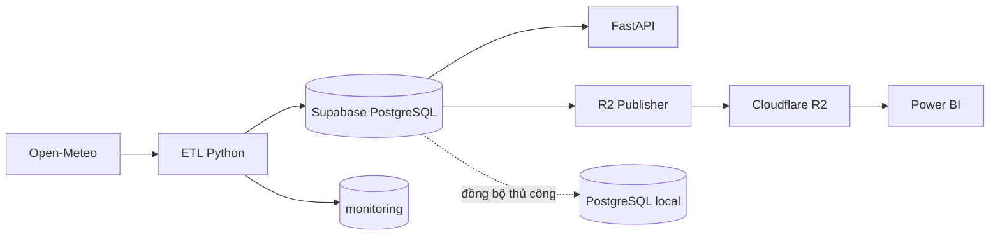

# Kiến Trúc Hệ Thống

## Luồng Chính



Supabase là nguồn dữ liệu chuẩn của automation. FastAPI đọc trực tiếp warehouse;
Power BI đọc CSV ổn định từ R2. PostgreSQL local chỉ phục vụ recovery hoặc phân tích
nội bộ khi người vận hành chủ động chạy đồng bộ.

## Thành Phần

| Thành phần | Trách nhiệm |
| --- | --- |
| Open-Meteo | Cung cấp weather archive/forecast và air quality |
| ETL | Extract, transform, validate, upsert và ghi trạng thái run |
| Supabase PostgreSQL | Lưu dữ liệu `analyst` và `monitoring` |
| FastAPI | Cung cấp dữ liệu warehouse qua REST |
| R2 publisher | Ghép snapshot, kiểm tra checksum/kích thước và kích hoạt release |
| Power BI | Đọc sáu CSV tại `v1/current/analyst/` |
| Cloud-to-local sync | Sao chép tăng dần từ Supabase về PostgreSQL local |

GitHub Actions chỉ cài môi trường và gọi CLI đóng gói trong dự án; logic ETL nằm
trong `src/etl/`, không nằm trong workflow.

## Cấu Trúc Mã Nguồn

```text
src/api/           FastAPI app, dependencies và routes
src/config/        Pydantic Settings
src/database/      SQLAlchemy models, session và Alembic migrations
src/etl/           CLI, extractors, transformers, validators, loaders, orchestration
src/models/        Pydantic response models
src/monitoring/    Structured logging và Discord notification
src/r2/            Export, merge, manifest và R2 publisher
src/repositories/  Truy vấn cho API
src/sync/          Đồng bộ Supabase -> PostgreSQL local
scripts/           Seed, report, catch-up, sync và R2 operations
ops/local/         Docker Compose cho API/PostgreSQL local
tests/api/         API contract tests
tests/unit/        Unit và workflow tests
```

## API

| Method | Route | Nội dung |
| --- | --- | --- |
| `GET` | `/health` | Trạng thái dịch vụ |
| `GET` | `/districts` | Danh sách quận/huyện |
| `GET` | `/districts/{district_id}` | Chi tiết một quận/huyện |
| `GET` | `/districts/{district_id}/daily` | Weather daily theo quận/huyện |
| `GET` | `/districts/{district_id}/hourly` | Weather hourly theo quận/huyện |
| `GET` | `/districts/{district_id}/aqi` | AQI hourly theo quận/huyện |
| `GET` | `/daily` | Weather daily có phân trang |
| `GET` | `/hourly` | Weather hourly có phân trang |
| `GET` | `/aqi` | AQI hourly có phân trang |
| `GET` | `/statistics` | Thống kê weather daily |

OpenAPI được FastAPI cung cấp tại `/openapi.json`, `/docs` và `/redoc`.

## Ranh Giới Vận Hành

- ETL dùng upsert nên có thể chạy lại cùng khóa mà không tạo bản ghi trùng.
- Scheduled workflow chạy đủ ba collector rồi mới publish R2. Manual workflow chỉ
  chạy collector được chọn và không publish R2.
- ETL lưu run, log và validation error trong schema `monitoring`.
- API middleware hiện phát structured log ra logger. Model
  `monitoring.api_requests` tồn tại nhưng middleware chưa ghi row vào bảng này.
- R2 là lớp phân phối chỉ đọc; credential ghi chỉ nằm trong môi trường vận hành.
- Chi tiết schema, lịch ETL và triển khai nằm trong các tài liệu chuyên trách được
  liên kết từ `README.md`.
