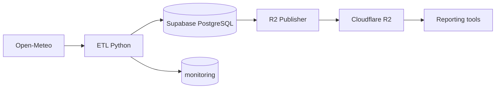

# Kiến Trúc Hệ Thống

## Luồng Chính



Supabase là nguồn dữ liệu chuẩn của automation. Cloudflare R2 phân phối snapshot
CSV/Parquet qua HTTP cho các công cụ xây dựng báo cáo, ví dụ Power BI.

## Thành Phần

| Thành phần | Trách nhiệm |
| --- | --- |
| Open-Meteo | Cung cấp weather archive/forecast và air quality |
| ETL | Extract, transform, validate, upsert và ghi trạng thái run |
| Supabase PostgreSQL | Lưu dữ liệu `analyst` và `monitoring` |
| R2 publisher | Ghép snapshot, kiểm tra checksum/kích thước và kích hoạt release |
| Công cụ báo cáo | Đọc snapshot tại `v1/current/analyst/` qua HTTP |

GitHub Actions chỉ cài môi trường và gọi CLI đóng gói trong dự án; logic ETL nằm
trong `src/etl/`, không nằm trong workflow.

## Cấu Trúc Mã Nguồn

```text
src/config/        Pydantic Settings
src/database/      SQLAlchemy models, session và Alembic migrations
src/etl/           CLI, extractors, transformers, validators, loaders, orchestration
src/monitoring/    Structured logging và Discord notification
src/r2/            Export, merge, manifest và R2 publisher
scripts/           Seed, report, catch-up và R2 operations
tests/unit/        Unit và workflow tests
```

## Ranh Giới Vận Hành

- ETL dùng upsert nên có thể chạy lại cùng khóa mà không tạo bản ghi trùng.
- Scheduled workflow chạy đủ ba collector rồi mới publish R2. Manual workflow chỉ
  chạy collector được chọn và không publish R2.
- ETL lưu run, log và validation error trong schema `monitoring`.
- R2 là lớp phân phối chỉ đọc; credential ghi chỉ nằm trong môi trường vận hành.
- Chi tiết schema, lịch ETL và triển khai nằm trong các tài liệu chuyên trách được
  liên kết từ `README.md`.
