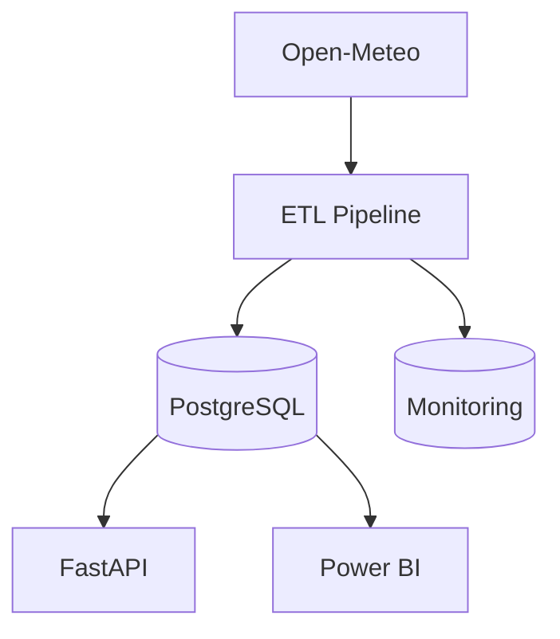

# Tổng Quan Kiến Trúc

```mermaid
flowchart TB
    OM[Open-Meteo] --> ETL[ETL Pipeline]
    ETL --> WH[(PostgreSQL)]
    ETL --> MON[(Monitoring)]
    WH --> API[FastAPI]
    WH --> BI[Power BI]
```

## Thành Phần

- ETL: extract, transform, validate, load.
- Warehouse: schema `analyst`.
- Monitoring: schema `monitoring`.
- API: FastAPI.
- Reporting: Power BI.
