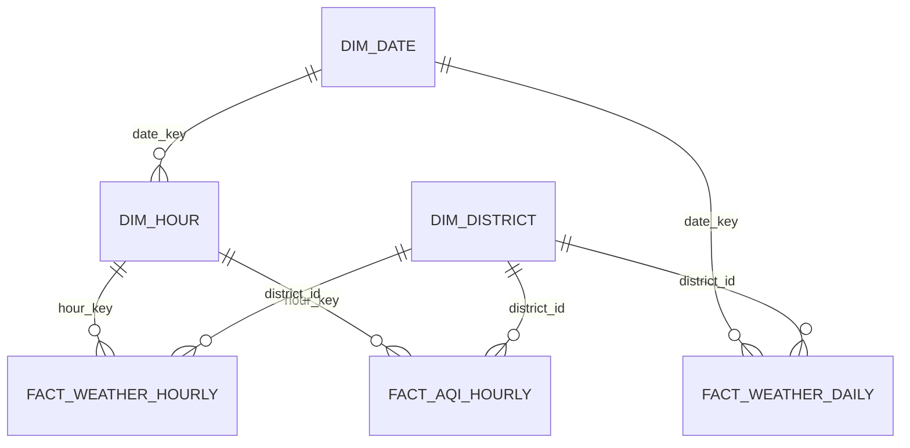

# Mô Hình Dữ Liệu

Warehouse dùng mô hình constellation: ba fact table chia sẻ dimension quận/huyện
và thời gian. Dữ liệu phân tích nằm trong schema `analyst`; trạng thái vận hành nằm
trong schema `monitoring`.

## Schema `analyst`

| Bảng | Khóa chính | Nội dung |
| --- | --- | --- |
| `dim_district` | `district_id` | 30 quận/huyện, tên và tọa độ |
| `dim_date` | `date_key` | Ngày, năm, quý, tháng, thứ và cuối tuần |
| `dim_hour` | `hour_key` | Timestamp hourly và `date_key` tương ứng |
| `fact_weather_daily` | `district_id, date_key` | Nhiệt độ, gió, bức xạ, mưa và weather code theo ngày |
| `fact_weather_hourly` | `district_id, hour_key` | Weather, gió, mây, bức xạ, mưa và độ ẩm đất theo giờ |
| `fact_aqi_hourly` | `district_id, hour_key` | Bụi, khí, ozone, UV và aerosol theo giờ |

## Quan Hệ



Weather hourly và AQI không lưu `date_key` hoặc timestamp lặp trong fact row; thời
gian được lấy qua `dim_hour`. Daily vẫn giữ `observed_date` để lọc snapshot.

## Schema `monitoring`

| Bảng | Vai trò hiện tại |
| --- | --- |
| `etl_runs` | Trạng thái, thời gian, số row và lỗi tóm tắt của mỗi run |
| `etl_logs` | Sự kiện có cấu trúc gắn với `etl_run_id` |
| `validation_errors` | Giá trị không hợp lệ, nguyên nhân và mức độ |
| `api_requests` | Bảng schema hiện có nhưng không nằm trong luồng vận hành hiện tại |

## Nguyên Tắc Thiết Kế

- Fact table dùng khóa nghiệp vụ/composite key; không dùng synthetic ID.
- Loader dùng PostgreSQL upsert theo khóa chính để chạy lại an toàn.
- `dim_hour` là nguồn thời gian duy nhất cho cả hai fact hourly.
- Các chỉ số đo lường dùng PostgreSQL `real`; weather code dùng `smallint`.
- Fact table không lặp `source`, `etl_run_id`, `created_at` hoặc `updated_at`.
- Metadata vận hành được tách khỏi dữ liệu phân tích.
- Không dùng row count hoặc min/max date ghi cứng trong tài liệu vì chúng thay đổi
  sau mỗi run.

Chuỗi migration hiện bắt đầu ở `a1b2c3d4e5f6` và head là `e5f6a7b8c9d0`.
Các migration đã tách schema, bỏ cột AQI/daily không dùng, chuyển measurement sang
`real` và chuẩn hóa `dim_hour`.

## Kiểm Tra Sau Migration

```powershell
.\.venv\Scripts\alembic.exe current
.\.venv\Scripts\python.exe -m pytest
.\.venv\Scripts\python.exe -m ruff check .
```

Kiểm tra dung lượng và row count trực tiếp trên database mục tiêu:

```sql
select pg_size_pretty(pg_database_size(current_database())) as database_size;

select schemaname, relname, n_live_tup
from pg_stat_user_tables
where schemaname in ('analyst', 'monitoring')
order by schemaname, relname;
```

Sau migration thay đổi storage hoặc drop column, kiểm tra thêm khóa ngoại mồ côi,
min/max ngày của ba fact table và smoke test ETL. Chỉ chạy `VACUUM FULL` trong
cửa sổ bảo trì vì lệnh khóa bảng và cần chạy ngoài transaction migration.
