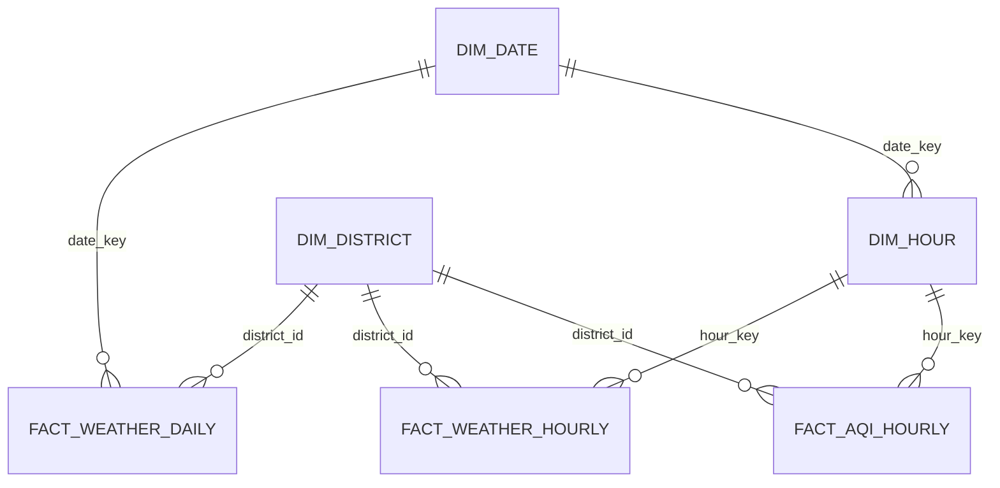

# Làm Sạch Dữ Liệu Warehouse

Tài liệu này mô tả phần làm sạch dữ liệu đã áp dụng cho luồng ETL và warehouse. Mục tiêu là
giữ dữ liệu phân tích cần thiết, loại bỏ trường dư thừa, chuẩn hóa khóa thời gian và làm cho
các bảng fact gọn hơn cho API, ETL và Power BI.

## Kết Quả Hiện Tại

- Dữ liệu hourly/AQI vẫn giữ đủ lịch sử từ `2023-06-01` đến `2026-07-07`.
- `analyst.dim_hour` lưu thời gian hourly dùng chung cho weather và AQI.
- `fact_weather_hourly` và `fact_aqi_hourly` tham chiếu thời gian bằng `hour_key`.
- `fact_weather_daily` giữ `date_key` và `observed_date` vì phục vụ API daily/statistics.
- Monitoring ETL nằm trong schema `monitoring`, không lặp metadata ở từng fact row.

## Các Nhóm Làm Sạch

1. Chuẩn hóa khóa fact:
   - Bỏ synthetic id ở fact tables.
   - Dùng khóa nghiệp vụ/composite key theo `district_id`, `date_key` hoặc `hour_key`.

2. Chuẩn hóa thời gian:
   - Tạo `analyst.dim_hour` cho dữ liệu hourly.
   - Weather hourly và AQI hourly dùng cùng `hour_key`.
   - `observed_at`, `observed_date`, `date_key` chỉ lưu một lần trong dimension thời gian.

3. Loại bỏ metadata lặp:
   - Bỏ `source` khỏi fact tables vì source hiện là cố định theo pipeline.
   - Bỏ `etl_run_id`, `created_at`, `updated_at` khỏi fact tables.
   - ETL run, log và lỗi validation được giữ ở schema `monitoring`.

4. Loại bỏ trường không có dữ liệu:
   - Bỏ các cột daily toàn `NULL`.
   - Chỉ giữ các chỉ số có dữ liệu thực tế và đang phục vụ API/reporting.

5. Chuẩn hóa kiểu dữ liệu:
   - Đổi các chỉ số đo lường từ `double precision` sang `real`.
   - Precision này đủ cho dữ liệu thời tiết/AQI và giúp bảng fact gọn hơn.

## Schema Sau Làm Sạch



## Quy Tắc Vận Hành

- Incremental là chế độ mặc định cho vận hành hằng ngày.
- Historical chỉ dùng khi cần backfill hoặc rebuild có chủ đích.
- Trước migration có drop column hoặc rewrite table, backup các fact table ra `.csv.gz`.
- Sau migration lớn, chạy `VACUUM FULL ANALYZE` ngoài transaction để database cập nhật layout vật lý.
- Sau cleanup, luôn kiểm tra row count, min/max date và smoke test API/ETL.

## Kiểm Tra Sau Cleanup

Kiểm tra dung lượng hiện tại của database:

```sql
select
  pg_size_pretty(pg_database_size(current_database())) as current_size,
  pg_database_size(current_database()) as bytes;
```

Kiểm tra các bảng lớn:

```sql
select
  schemaname,
  relname,
  pg_size_pretty(pg_total_relation_size(relid)) as total_size,
  pg_size_pretty(pg_relation_size(relid)) as table_size,
  pg_size_pretty(pg_indexes_size(relid)) as index_size
from pg_catalog.pg_statio_user_tables
where schemaname in ('analyst', 'monitoring')
order by pg_total_relation_size(relid) desc;
```

Kiểm tra chất lượng sau migration:

```powershell
.\.venv\Scripts\python.exe -m ruff check .
.\.venv\Scripts\python.exe -m pytest
.\.venv\Scripts\alembic.exe current
```

Smoke test ETL một quận:

```powershell
.\.venv\Scripts\python.exe -c "import sys; from src.etl.cli import main; sys.argv=['vwdp-etl','--run-type','incremental-daily','--max-districts','1','--request-delay-seconds','0']; raise SystemExit(main())"
.\.venv\Scripts\python.exe -c "import sys; from src.etl.cli import main; sys.argv=['vwdp-etl','--run-type','incremental-hourly','--max-districts','1','--request-delay-seconds','0']; raise SystemExit(main())"
.\.venv\Scripts\python.exe -c "import sys; from src.etl.cli import main; sys.argv=['vwdp-etl','--run-type','incremental-aqi-hourly','--max-districts','1','--request-delay-seconds','0']; raise SystemExit(main())"
```
