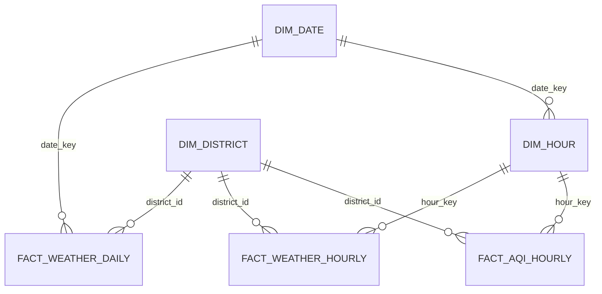

# Thiết Kế Warehouse

## Bảng Chính

- `analyst.dim_date`
- `analyst.dim_hour`
- `analyst.dim_district`
- `analyst.fact_weather_daily`
- `analyst.fact_weather_hourly`
- `analyst.fact_aqi_hourly`
- `monitoring.etl_runs`
- `monitoring.etl_logs`
- `monitoring.validation_errors`
- `monitoring.api_requests`

## Làm Sạch Dữ Liệu

Hourly weather và AQI dùng chung `analyst.dim_hour` để tránh lặp các trường thời gian trong
từng fact table. Các fact table không lưu `source`, `etl_run_id`, `created_at`, `updated_at`
vì monitoring đã nằm trong schema `monitoring` và các source hiện là cố định.

Chi tiết quy trình cleanup nằm ở `docs/database/data-cleanup.md`.
