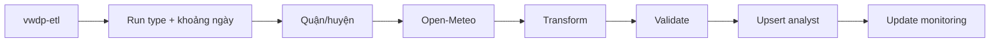

# ETL Và Tự Động Hóa

## Luồng Xử Lý



Entry point `vwdp-etl = "src.etl.cli:main"` được khai báo trong `pyproject.toml`.
CLI nhận `--district-id` lặp lại được, `--max-districts` và
`--request-delay-seconds` để giới hạn phạm vi.

## Run Type Và Khoảng Ngày

| Nhóm | Run type |
| --- | --- |
| Historical | `historical-daily`, `historical-hourly`, `historical-aqi-hourly` |
| Incremental | `incremental-daily`, `incremental-hourly`, `incremental-aqi-hourly` |
| Forecast | `forecast-daily`, `forecast-hourly`, `forecast-aqi-hourly` |

Khi không truyền ngày:

- Historical chạy từ `2023-06-01` đến hôm qua theo `Asia/Ho_Chi_Minh`.
- Incremental chỉ chạy ngày hôm qua (`INCREMENTAL_LOOKBACK_DAYS = 1`).
- Forecast cũng chọn ngày hôm qua theo logic CLI hiện tại.

Có thể ghi đè khoảng ngày cho mọi run type, nhưng phải truyền đồng thời hai cờ và
`start-date <= end-date`:

```powershell
poetry run vwdp-etl --run-type historical-daily `
  --start-date 2026-07-01 --end-date 2026-07-03
```

## Chạy Local

```powershell
# Toàn bộ quận/huyện, ngày hôm qua
poetry run vwdp-etl --run-type incremental-daily

# Hai district ID cụ thể
poetry run vwdp-etl --run-type incremental-hourly `
  --district-id 1 --district-id 2 --request-delay-seconds 0

# Hai quận/huyện đầu tiên
poetry run vwdp-etl --run-type incremental-aqi-hourly `
  --max-districts 2 --request-delay-seconds 0
```

Giá trị `--max-districts` phải lớn hơn `0`; delay không được âm. Mỗi run tạo một
row trong `monitoring.etl_runs`; lỗi validation được lưu riêng để không làm mất
toàn bộ dữ liệu hợp lệ của run.

## GitHub Actions

Workflow `Daily ETL` chạy cron `0 18 * * *`, tương đương `01:00` ngày hôm sau tại
Việt Nam. Bảy job theo thứ tự:

1. Kiểm tra mã nguồn: pytest và Ruff.
2. Chuẩn bị database: migration, seed district và `dim_date`.
3. Thu thập weather daily.
4. Thu thập weather hourly.
5. Thu thập AQI hourly.
6. Publish release R2.
7. Tổng hợp kết quả và gửi Discord nếu được bật.

Scheduled run luôn gọi đủ ba incremental collector; R2 chỉ chạy khi cả ba thành
công. Manual run chỉ gọi collector khớp với run type đã chọn và không publish R2.
Concurrency group không hủy run đang chạy.

Các preset hiện có trong giao diện `Run workflow`:

| Nhãn | Phạm vi |
| --- | --- |
| `Demo daily - 2 quận` | Incremental daily, tối đa 2 district, delay 0 |
| `Demo hourly - 2 quận` | Incremental hourly, tối đa 2 district, delay 0 |
| `Demo AQI hourly - 2 quận` | Incremental AQI hourly, tối đa 2 district, delay 0 |
| `Chạy thật daily - toàn bộ quận` | Incremental daily, toàn bộ district |
| `Chạy thật hourly - toàn bộ quận` | Incremental hourly, toàn bộ district |
| `Chạy thật AQI hourly - toàn bộ quận` | Incremental AQI hourly, toàn bộ district |
| `custom` | Dùng các input chi tiết |

Với `custom`, các input hỗ trợ gồm `run_type`, `demo_mode`, `district_ids`,
`max_districts`, `start_date`, `end_date` và `request_delay_seconds`.

## Demo

Demo local ngắn nhất:

```powershell
poetry run vwdp-etl --run-type incremental-daily `
  --district-id 1 --district-id 2 --request-delay-seconds 0
```

Trên GitHub Actions, chọn một trong ba preset `Demo ... - 2 quận`; các input còn
lại có thể giữ mặc định. Đây chỉ là bằng chứng luồng ETL, không phải bằng chứng
publish R2.

## Manual Catch-Up

Khi scheduled run bỏ lỡ một khoảng ngày, dùng script PowerShell để chạy migration,
seed, đủ ba ETL, publish bounded R2 và verify:

```powershell
.\scripts\run_manual_catchup.ps1 `
  -StartDate 2026-07-28 -EndDate 2026-07-28
```

Các cờ vận hành:

- `-DryRun`: chỉ in lệnh.
- `-SkipPrepare`: bỏ migration và seed.
- `-SkipR2`: chỉ sửa dữ liệu Supabase.
- `-RunType incremental-daily|incremental-hourly|incremental-aqi-hourly`: chỉ chạy
  một collector; R2 tự bỏ qua vì snapshot yêu cầu đủ ba loại.

Script ưu tiên `.venv\Scripts\python.exe` và Alembic local, sau đó mới dùng Poetry.
Không chạy publisher cho một fact table đơn lẻ vì release yêu cầu max date của ba
fact table đồng nhất.

## Bằng Chứng Sau Khi Chạy

Không dùng riêng badge xanh làm bằng chứng. Với run đầy đủ, kiểm tra:

- số row của từng collector trong log và `GITHUB_STEP_SUMMARY`;
- trạng thái/số row trong `monitoring.etl_runs`;
- row count và max date của ba fact table trong warehouse;
- release ID, manifest, checksum và sáu current CSV trên R2;
- Discord chỉ là thông báo, không thay thế các kiểm tra trên.

Nếu gặp `429`, giảm phạm vi hoặc tăng delay rồi chạy lại bounded range. Nếu ETL đã
thành công nhưng R2 lỗi, chạy lại publisher thay vì gọi lại Open-Meteo.
