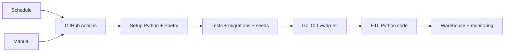

# Tự Động Hóa ETL



`vwdp-etl` được khai báo trong `pyproject.toml`:

```toml
vwdp-etl = "src.etl.cli:main"
```

GitHub Actions không chứa logic ETL; workflow chỉ setup môi trường rồi chạy lệnh CLI.

## Chế Độ

| Chế độ | Hành vi |
| --- | --- |
| Schedule | Gọi CLI với `incremental-daily`, `incremental-hourly`, `incremental-aqi-hourly` |
| Manual preset | Chọn nhanh demo nhỏ hoặc chạy thật từ ô `quick_preset` |
| Manual custom | Chọn `quick_preset=custom`, sau đó tự nhập `run_type` và các giới hạn |
| Demo mode | Mặc định `--max-districts 2 --request-delay-seconds 0` |

## Chọn Nhanh Trên GitHub Actions

| `quick_preset` | Hành vi |
| --- | --- |
| `demo-daily-2-districts` | Demo daily cho 2 quận đầu tiên, delay 0 |
| `demo-hourly-2-districts` | Demo hourly cho 2 quận đầu tiên, delay 0 |
| `demo-aqi-2-districts` | Demo AQI hourly cho 2 quận đầu tiên, delay 0 |
| `full-incremental-daily` | Chạy thật daily cho toàn bộ quận/huyện |
| `full-incremental-hourly` | Chạy thật hourly cho toàn bộ quận/huyện |
| `full-incremental-aqi-hourly` | Chạy thật AQI hourly cho toàn bộ quận/huyện |
| `custom` | Tự nhập các trường bên dưới |

Các input `run_type`, `demo_mode`, `district_ids`, `max_districts`, `start_date`,
`end_date`, `request_delay_seconds` chỉ cần quan tâm khi chọn `quick_preset=custom`.

```text
số request = số run type * số quận/huyện được chọn
```
