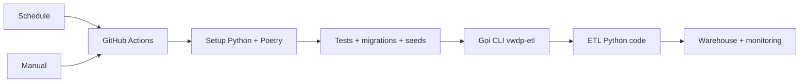

# Tự Động Hóa ETL



`vwdp-etl` được khai báo trong `pyproject.toml`:

```toml
vwdp-etl = "src.etl.cli:main"
```

GitHub Actions không chứa logic ETL; workflow chỉ setup môi trường rồi chạy lệnh CLI.

## Chế Độ

| Chế độ | Hành vi |
| --- | --- |
| Schedule | Gọi CLI với `incremental-daily`, `incremental-hourly`, `incremental-aqi-hourly` |
| Manual | Gọi CLI với `run_type` được chọn |
| Demo mode | Mặc định `--max-districts 2 --request-delay-seconds 0` |

## Input Demo

`run_type`, `demo_mode`, `district_ids`, `max_districts`, `start_date`, `end_date`, `request_delay_seconds`.

```text
số request = số run type * số quận/huyện được chọn
```
