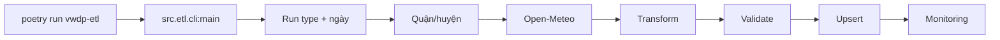

# Luồng ETL



GitHub Actions cũng chạy cùng CLI này; điểm khác nhau chỉ là lệnh được gọi tự động theo cron hoặc thủ công.

## Run Type

- Historical: `historical-daily`, `historical-hourly`, `historical-aqi-hourly`.
- Incremental: `incremental-daily`, `incremental-hourly`, `incremental-aqi-hourly`.
- Forecast: `forecast-daily`, `forecast-hourly`, `forecast-aqi-hourly`.

## Ghi Chú

- Incremental lấy 3 ngày đã hoàn tất gần nhất.
- Historical bắt đầu từ `2023-06-01`.
- Loader dùng `upsert`, nên chạy lại không tạo bản ghi trùng.
- Loader hourly/AQI upsert `analyst.dim_hour` trước, rồi ghi fact bằng `hour_key`.
- Quy trình cleanup dữ liệu warehouse được ghi ở `docs/database/data-cleanup.md`.

## Demo

```powershell
poetry run vwdp-etl --run-type incremental-daily --district-id 1 --district-id 2 --request-delay-seconds 0
```
